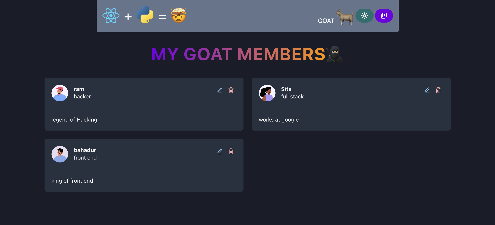

# Fullstack Python + React App

🚀 **Live Demo**: [https://fullstack-python-react-1.onrender.com/](https://fullstack-python-react-1.onrender.com/)



This is a full-stack web application built using:

- 🔥 **React** for the frontend
- 🐍 **Python (Flask / FastAPI)** for the backend API
- 📦 Hosted on [Render](https://render.com)

---

## Features

- Modern UI built with React
- RESTful API using Python
- Async communication between frontend and backend
- Fully deployable and live on the internet

---

## 🛠️ Tech Stack

| Layer      | Tech            |
| ---------- | --------------- |
| Frontend   | React, JSX, CSS |
| Backend    | Python Flask    |
| Deployment | Render          |

---

## 📦 Installation

### 1. Clone the repo

```bash
git clone https://github.com/your-username/fullstack-python-react.git
cd fullstack-python-react
```
